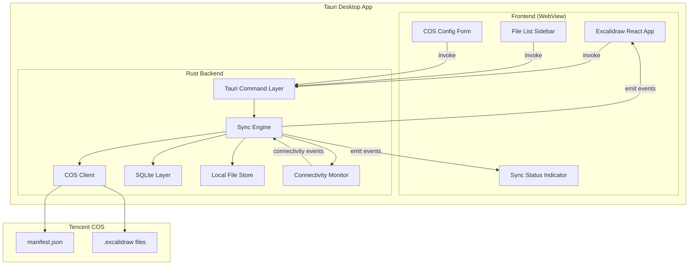
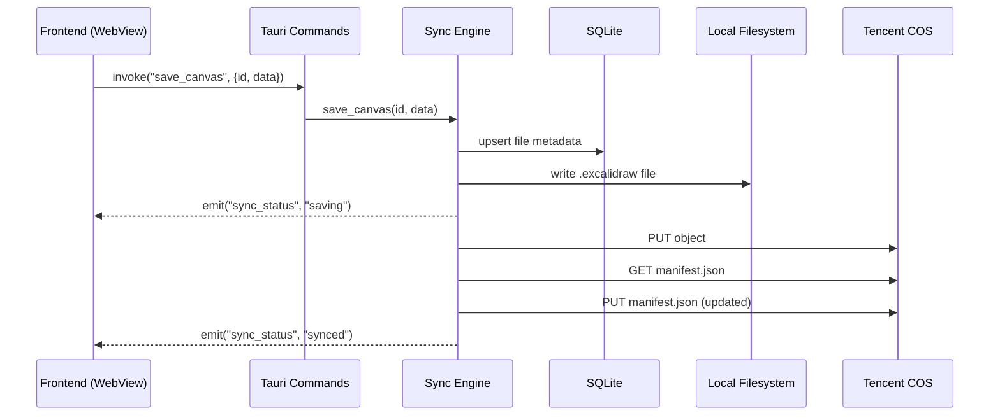

# Design Document: Cloud Sync Desktop

## Overview

This design transforms the Excalidraw web application into a Tauri v2 desktop application with cloud synchronization via Tencent Cloud Object Storage (COS). The architecture follows a two-process model: a Rust backend handling all I/O (COS API, SQLite, filesystem) and the existing React frontend running inside a Tauri WebView. Communication between the two layers uses Tauri's typed IPC command system.

Key design decisions:
- **Tencent COS via S3-compatible API**: COS exposes an S3-compatible REST API, allowing us to use the `aws-sdk-s3` Rust crate rather than building a custom HTTP client. This provides well-tested request signing, retry logic, and streaming uploads.
- **SQLite for metadata**: A single SQLite database stores file metadata, sync queue, and conflict tracking. This gives us ACID transactions for state consistency and survives app crashes.
- **Manifest-based sync**: A single `manifest.json` on COS acts as the cross-device file index. Polling at 30-second intervals keeps devices in sync without requiring a server.
- **Optimistic local-first**: All operations write to local cache first, then sync to cloud asynchronously. The user never waits for network operations to complete their work.

## Architecture



### Process Architecture



## Components and Interfaces

### Tauri Command Layer

The command layer exposes Rust functions to the frontend via `#[tauri::command]`. All commands are async and return `Result<T, String>` for error propagation.

```rust
// COS Configuration
#[tauri::command]
async fn save_cos_config(config: CosConfig) -> Result<(), String>;

#[tauri::command]
async fn validate_cos_config(config: CosConfig) -> Result<bool, String>;

#[tauri::command]
async fn get_cos_config() -> Result<Option<CosConfig>, String>;

// File Operations
#[tauri::command]
async fn save_canvas(file_id: String, data: CanvasData) -> Result<SyncStatus, String>;

#[tauri::command]
async fn load_canvas(file_id: String) -> Result<CanvasData, String>;

#[tauri::command]
async fn create_new_file() -> Result<FileEntry, String>;

#[tauri::command]
async fn delete_file(file_id: String) -> Result<(), String>;

#[tauri::command]
async fn rename_file(file_id: String, new_title: String) -> Result<(), String>;

#[tauri::command]
async fn export_file(file_id: String, path: String) -> Result<(), String>;

// File List
#[tauri::command]
async fn get_file_list() -> Result<Vec<FileEntry>, String>;

// Sync
#[tauri::command]
async fn trigger_sync() -> Result<(), String>;

#[tauri::command]
async fn get_sync_status(file_id: String) -> Result<SyncStatus, String>;
```

### Sync Engine

The sync engine is the core orchestrator. It runs as a background task within the Tauri app, managing:
- Auto-save debouncing (2-second timer)
- Upload queue processing
- Manifest polling (30-second interval)
- Conflict detection and resolution
- Connectivity monitoring

```rust
pub struct SyncEngine {
    cos_client: CosClient,
    db: Database,
    file_store: FileStore,
    conn_monitor: ConnectivityMonitor,
    upload_queue: Arc<Mutex<VecDeque<QueuedUpload>>>,
    poll_handle: Option<JoinHandle<()>>,
}

impl SyncEngine {
    pub async fn start(&mut self, app_handle: AppHandle) -> Result<()>;
    pub async fn stop(&mut self);
    pub async fn save_canvas(&self, file_id: &str, data: &CanvasData) -> Result<SyncStatus>;
    pub async fn load_canvas(&self, file_id: &str) -> Result<CanvasData>;
    pub async fn sync_manifest(&self) -> Result<()>;
    pub async fn process_upload_queue(&self) -> Result<()>;
    pub async fn detect_conflicts(&self, remote_manifest: &Manifest) -> Vec<Conflict>;
    pub async fn resolve_conflict(&self, conflict: Conflict) -> Result<()>;
}
```

### COS Client

Wraps the S3-compatible API calls using `aws-sdk-s3` configured for Tencent COS endpoints.

```rust
pub struct CosClient {
    client: aws_sdk_s3::Client,
    bucket: String,
}

impl CosClient {
    pub fn new(config: &CosConfig) -> Result<Self>;
    pub async fn put_object(&self, key: &str, body: Vec<u8>) -> Result<()>;
    pub async fn get_object(&self, key: &str) -> Result<Vec<u8>>;
    pub async fn delete_object(&self, key: &str) -> Result<()>;
    pub async fn head_object(&self, key: &str) -> Result<ObjectMetadata>;
    pub async fn test_connection(&self) -> Result<bool>;
}
```

### SQLite Layer

Manages all metadata persistence using `rusqlite`.

```rust
pub struct Database {
    conn: Connection,
}

impl Database {
    pub fn open(path: &Path) -> Result<Self>;
    pub fn upsert_file_meta(&self, meta: &FileMeta) -> Result<()>;
    pub fn get_file_meta(&self, file_id: &str) -> Result<Option<FileMeta>>;
    pub fn get_all_files(&self) -> Result<Vec<FileMeta>>;
    pub fn delete_file_meta(&self, file_id: &str) -> Result<()>;
    pub fn enqueue_upload(&self, entry: &QueuedUpload) -> Result<()>;
    pub fn dequeue_upload(&self, file_id: &str) -> Result<()>;
    pub fn get_pending_uploads(&self) -> Result<Vec<QueuedUpload>>;
    pub fn save_cos_config(&self, config: &CosConfig) -> Result<()>;
    pub fn get_cos_config(&self) -> Result<Option<CosConfig>>;
}
```

### Frontend Components

#### File List Sidebar
A React component rendered alongside the Excalidraw editor. It subscribes to Tauri events for real-time updates.

```typescript
interface FileEntry {
  id: string;
  title: string;
  lastModified: number; // Unix timestamp ms
  syncStatus: "synced" | "pending-sync" | "conflict";
  isConflictCopy: boolean;
  parentFileId?: string; // set for conflict copies
}

interface FileListSidebarProps {
  files: FileEntry[];
  activeFileId: string | null;
  onFileSelect: (fileId: string) => void;
  onFileRename: (fileId: string, newTitle: string) => void;
  onFileDelete: (fileId: string) => void;
  onNewFile: () => void;
}
```

#### Sync Status Indicator
A small UI element showing the current sync state of the active file.

```typescript
type SyncStatus = "idle" | "saving" | "synced" | "pending-sync" | "error";

interface SyncStatusIndicatorProps {
  status: SyncStatus;
  lastSyncTime?: number;
}
```

#### COS Configuration Form
Displayed on first launch or when config is invalid.

```typescript
interface CosConfigFormProps {
  initialValues?: Partial<CosConfig>;
  onSubmit: (config: CosConfig) => Promise<void>;
  error?: string;
}

interface CosConfig {
  secretId: string;
  secretKey: string;
  bucket: string;
  region: string;
}
```

## Data Models

### SQLite Schema

```sql
CREATE TABLE files (
    id TEXT PRIMARY KEY,
    title TEXT NOT NULL DEFAULT 'Untitled',
    last_modified INTEGER NOT NULL,
    content_hash TEXT NOT NULL,
    cos_object_key TEXT,
    sync_status TEXT NOT NULL DEFAULT 'pending-sync',
    base_content_hash TEXT,  -- hash at last successful sync
    is_conflict_copy INTEGER NOT NULL DEFAULT 0,
    parent_file_id TEXT,
    deleted INTEGER NOT NULL DEFAULT 0,
    created_at INTEGER NOT NULL
);

CREATE TABLE upload_queue (
    id INTEGER PRIMARY KEY AUTOINCREMENT,
    file_id TEXT NOT NULL,
    operation TEXT NOT NULL,  -- 'upload', 'delete', 'rename'
    payload TEXT,  -- JSON payload for the operation
    retry_count INTEGER NOT NULL DEFAULT 0,
    max_retries INTEGER NOT NULL DEFAULT 5,
    created_at INTEGER NOT NULL,
    FOREIGN KEY (file_id) REFERENCES files(id)
);

CREATE TABLE cos_config (
    id INTEGER PRIMARY KEY CHECK (id = 1),
    secret_id TEXT NOT NULL,
    secret_key TEXT NOT NULL,
    bucket TEXT NOT NULL,
    region TEXT NOT NULL,
    validated INTEGER NOT NULL DEFAULT 0
);

CREATE INDEX idx_files_last_modified ON files(last_modified DESC);
CREATE INDEX idx_files_sync_status ON files(sync_status);
CREATE INDEX idx_upload_queue_created ON upload_queue(created_at ASC);
```

### Manifest Schema (manifest.json on COS)

```json
{
  "version": 1,
  "lastModified": 1700000000000,
  "files": [
    {
      "id": "uuid-v4-string",
      "title": "My Drawing",
      "lastModified": 1700000000000,
      "contentHash": "sha256-hex-string",
      "objectKey": "files/uuid-v4-string.excalidraw",
      "deleted": false
    }
  ]
}
```

### COS Object Layout

```
bucket-root/
├── manifest.json
└── files/
    ├── {uuid}.excalidraw
    ├── {uuid}.excalidraw
    └── {uuid}-conflict-2024-01-15.excalidraw
```

### Canvas Data Format

The `.excalidraw` file format is the existing Excalidraw JSON format:

```typescript
interface ExcalidrawFileData {
  type: "excalidraw";
  version: number;
  source: string;
  elements: ExcalidrawElement[];
  appState: Partial<AppState>;
  files?: BinaryFiles;
}
```

### Rust Data Structures

```rust
#[derive(Serialize, Deserialize, Clone)]
pub struct CosConfig {
    pub secret_id: String,
    pub secret_key: String,
    pub bucket: String,
    pub region: String,
}

#[derive(Serialize, Deserialize, Clone)]
pub struct FileMeta {
    pub id: String,
    pub title: String,
    pub last_modified: i64,
    pub content_hash: String,
    pub cos_object_key: Option<String>,
    pub sync_status: SyncStatus,
    pub base_content_hash: Option<String>,
    pub is_conflict_copy: bool,
    pub parent_file_id: Option<String>,
    pub deleted: bool,
    pub created_at: i64,
}

#[derive(Serialize, Deserialize, Clone)]
pub struct ManifestEntry {
    pub id: String,
    pub title: String,
    pub last_modified: i64,
    pub content_hash: String,
    pub object_key: String,
    pub deleted: bool,
}

#[derive(Serialize, Deserialize, Clone)]
pub struct Manifest {
    pub version: u32,
    pub last_modified: i64,
    pub files: Vec<ManifestEntry>,
}

#[derive(Serialize, Deserialize, Clone, PartialEq)]
pub enum SyncStatus {
    Synced,
    PendingSync,
    Saving,
    Conflict,
    Error,
}

#[derive(Serialize, Deserialize, Clone)]
pub struct QueuedUpload {
    pub id: i64,
    pub file_id: String,
    pub operation: UploadOperation,
    pub payload: Option<String>,
    pub retry_count: u32,
    pub max_retries: u32,
    pub created_at: i64,
}

#[derive(Serialize, Deserialize, Clone)]
pub enum UploadOperation {
    Upload,
    Delete,
    Rename,
}

#[derive(Serialize, Deserialize, Clone)]
pub struct Conflict {
    pub file_id: String,
    pub local_hash: String,
    pub remote_hash: String,
    pub base_hash: String,
    pub remote_last_modified: i64,
}
```


## Correctness Properties

*A property is a characteristic or behavior that should hold true across all valid executions of a system — essentially, a formal statement about what the system should do. Properties serve as the bridge between human-readable specifications and machine-verifiable correctness guarantees.*

### Property 1: COS Configuration Round-Trip

*For any* valid COS configuration (non-empty SecretId, SecretKey, Bucket, and Region), saving the configuration to the local store and then loading it back SHALL produce an identical configuration object.

**Validates: Requirements 2.2**

### Property 2: Debounce Saves Final State

*For any* sequence of canvas modifications with timestamps, the sync engine SHALL save exactly one state to the local cache — the state corresponding to the last modification — after 2 seconds of inactivity have elapsed since that last modification.

**Validates: Requirements 3.1**

### Property 3: Manifest Serialization Completeness

*For any* file metadata (file ID, title, last modified timestamp, content hash, COS object key, deleted flag), serializing it into the manifest JSON format and deserializing it back SHALL produce an equivalent object with all fields present and correct.

**Validates: Requirements 3.3, 6.2**

### Property 4: Upload Retry Respects Maximum Attempts

*For any* file in the upload queue with N consecutive failures where N <= 5, the sync engine SHALL keep the file marked as pending-sync and schedule a retry. When N exceeds 5, the sync engine SHALL stop retrying and emit a failure indicator.

**Validates: Requirements 3.5, 3.6**

### Property 5: Sync Status State Machine

*For any* sequence of sync events (save-started, save-completed, upload-started, upload-succeeded, upload-failed), the reported sync status SHALL always reflect the correct state according to the transition rules: saving → synced (on upload success), saving → pending-sync (on upload failure or offline).

**Validates: Requirements 3.7**

### Property 6: Manifest Merge by Timestamp

*For any* local file metadata set and remote manifest, merging them SHALL produce a result where each file entry uses the version with the later last-modified timestamp, new remote entries are added to the local set, and entries marked as deleted in the remote are removed locally.

**Validates: Requirements 4.1, 6.3, 6.7, 8.5**

### Property 7: Cache Decision by Hash Comparison

*For any* file selection where the local content hash matches the manifest content hash, the sync engine SHALL load from local cache without network access. For any file where the hashes differ or the file is absent locally, the sync engine SHALL trigger a download from COS.

**Validates: Requirements 4.3, 4.4**

### Property 8: Save Before File Switch

*For any* file switch operation (selecting a different file, creating a new canvas), if the current canvas has unsaved modifications, the sync engine SHALL persist the current canvas data to the local cache before loading or clearing the editor. If the current canvas has no unsaved modifications, no save operation SHALL occur.

**Validates: Requirements 4.6, 4.7, 5.2, 9.1**

### Property 9: File List Sort Order

*For any* set of file entries with distinct last-modified timestamps, the file list sidebar SHALL display them in strictly descending order by last-modified timestamp.

**Validates: Requirements 5.1**

### Property 10: Title Display Truncation

*For any* file title longer than 50 characters, the displayed title in the file list sidebar SHALL be exactly the first 50 characters followed by an ellipsis ("…"). For any title of 50 characters or fewer, the displayed title SHALL be the full title unchanged.

**Validates: Requirements 5.3**

### Property 11: Title Validation

*For any* rename attempt with a title exceeding 100 characters, the operation SHALL be rejected. *For any* rename attempt with a title composed entirely of whitespace characters (including empty string), the operation SHALL be rejected and the previous title SHALL be retained.

**Validates: Requirements 5.5, 5.6**

### Property 12: Canvas Data Filesystem Round-Trip

*For any* valid canvas data (elements array, appState object, optional files map), writing it as a `.excalidraw` JSON file to the local filesystem and reading it back SHALL produce an equivalent canvas data object.

**Validates: Requirements 7.2**

### Property 13: Offline Queue Persistence

*For any* set of changes made while offline, all changes SHALL appear in the SQLite upload queue. After a simulated application restart (close and reopen the database), all queued entries SHALL still be present and unmodified.

**Validates: Requirements 7.3**

### Property 14: Queue Upload Chronological Order

*For any* set of queued uploads with distinct creation timestamps, the sync engine SHALL process them in strictly ascending chronological order (oldest first).

**Validates: Requirements 7.4**

### Property 15: Queue Processing Resilience

*For any* upload queue containing N items where K items fail (K < N), the sync engine SHALL successfully process all (N - K) non-failing items and leave only the K failing items in the queue for retry.

**Validates: Requirements 7.5**

### Property 16: Conflict Detection

*For any* file where the remote content hash differs from the base content hash (recorded at last successful sync) AND the local content hash also differs from the base content hash, the sync engine SHALL identify this as a conflict. If only the remote differs (local unchanged), it is NOT a conflict but a remote update.

**Validates: Requirements 8.1**

### Property 17: Conflict Resolution Creates Named Copy

*For any* detected conflict, the sync engine SHALL create a conflict copy with the title format "{original_title} - Conflict {YYYY-MM-DD}" where the date is the conflict detection date, and SHALL upload the local version as the new primary file on COS.

**Validates: Requirements 8.2**

### Property 18: Maximum Conflict Copies Invariant

*For any* file, the number of associated conflict copies SHALL never exceed 5. When a new conflict would create a 6th copy, the oldest conflict copy (by creation date) SHALL be deleted before the new one is created.

**Validates: Requirements 8.7**

### Property 19: New File Uniqueness

*For any* set of N newly created files, all N file IDs SHALL be distinct from each other, and each new file SHALL have an empty canvas data (zero elements).

**Validates: Requirements 9.2**

## Error Handling

### Network Errors

| Scenario | Behavior |
|----------|----------|
| COS upload fails | Mark file as pending-sync, retry up to 5 times at 30s intervals |
| COS download fails | Show error message, retain current canvas unchanged |
| Manifest download fails at startup | Use local cache, show "may be outdated" indicator |
| Manifest upload conflict (concurrent modification) | Re-download, re-merge, retry up to 3 times |
| Network connectivity lost | Queue all changes locally, process queue when connectivity returns |
| COS config validation timeout (>10s) | Show connection failure error, retain form values |

### Data Errors

| Scenario | Behavior |
|----------|----------|
| Corrupt manifest.json on COS | Log error, use local cache, notify user of sync issue |
| Corrupt .excalidraw file on disk | Log error, attempt re-download from COS if available |
| SQLite database corruption | Attempt recovery, rebuild from COS manifest if possible |
| File exceeds 100 MB size limit | Reject upload, notify user, keep local copy |
| Invalid canvas data format | Reject load, show error, retain current canvas |

### User Input Errors

| Scenario | Behavior |
|----------|----------|
| Empty/whitespace-only file title | Reject rename, retain previous title |
| Title exceeds 100 characters | Reject rename |
| Empty COS config fields | Prevent form submission (client-side validation) |
| Export to read-only location | Show filesystem error message, preserve canvas data |

### Graceful Degradation

The application follows a "local-first" degradation strategy:
1. **Full connectivity**: Real-time sync to COS, manifest polling active
2. **Intermittent connectivity**: Queue uploads, process when possible, show pending status
3. **No connectivity**: Full offline mode, all operations work against local cache
4. **Invalid COS config**: Local-only mode, all files saved locally, no sync attempted

## Testing Strategy

### Property-Based Testing

This feature is well-suited for property-based testing because it involves:
- Data serialization/deserialization (manifest, canvas data, config)
- State machine logic (sync status transitions)
- Merge algorithms (manifest reconciliation)
- Input validation (titles, config fields)
- Queue processing logic (ordering, resilience)
- Conflict detection algorithms (hash comparisons)

**Library**: [fast-check](https://github.com/dubzzz/fast-check) for TypeScript frontend logic, and `proptest` for Rust backend logic.

**Configuration**:
- Minimum 100 iterations per property test
- Each test tagged with: `Feature: cloud-sync-desktop, Property {N}: {property_text}`

**Property tests cover**:
- Properties 1-19 as defined in the Correctness Properties section
- Generators for: CosConfig, FileMeta, ManifestEntry, CanvasData, SyncEvent sequences, title strings, hash values

### Unit Tests

Unit tests complement property tests by covering:
- Specific examples of correct behavior (happy paths)
- Edge cases: empty file list, single file, max retries reached
- Error conditions: network timeout, invalid JSON, missing fields
- UI component rendering: sidebar displays correct items, status indicator shows correct icon

### Integration Tests

Integration tests verify end-to-end flows:
- Full save cycle: modify canvas → debounce → local save → COS upload → manifest update
- Full load cycle: select file → hash check → download → render
- Offline/online transition: make changes offline → restore connectivity → queue processes
- Conflict scenario: edit on two devices → detect conflict → create conflict copy
- COS config validation: submit config → test connection → persist or show error

### Test Organization

```
src-tauri/
├── src/
│   ├── tests/
│   │   ├── property/          # Rust property tests (proptest)
│   │   │   ├── manifest_tests.rs
│   │   │   ├── sync_engine_tests.rs
│   │   │   ├── conflict_tests.rs
│   │   │   └── queue_tests.rs
│   │   ├── unit/              # Rust unit tests
│   │   │   ├── cos_client_tests.rs
│   │   │   ├── database_tests.rs
│   │   │   └── file_store_tests.rs
│   │   └── integration/       # Rust integration tests
│   │       └── sync_flow_tests.rs
excalidraw-app/
├── src/
│   ├── cloud-sync/
│   │   ├── __tests__/
│   │   │   ├── property/      # TypeScript property tests (fast-check)
│   │   │   │   ├── title-validation.property.test.ts
│   │   │   │   ├── file-list-sort.property.test.ts
│   │   │   │   └── sync-status.property.test.ts
│   │   │   ├── unit/          # TypeScript unit tests
│   │   │   │   ├── FileListSidebar.test.tsx
│   │   │   │   ├── SyncStatusIndicator.test.tsx
│   │   │   │   └── CosConfigForm.test.tsx
```
